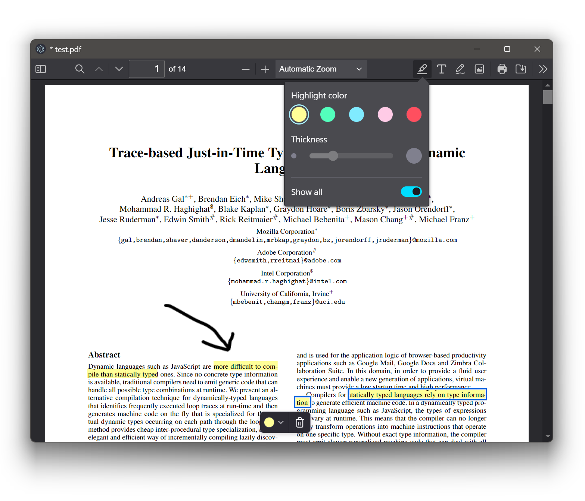
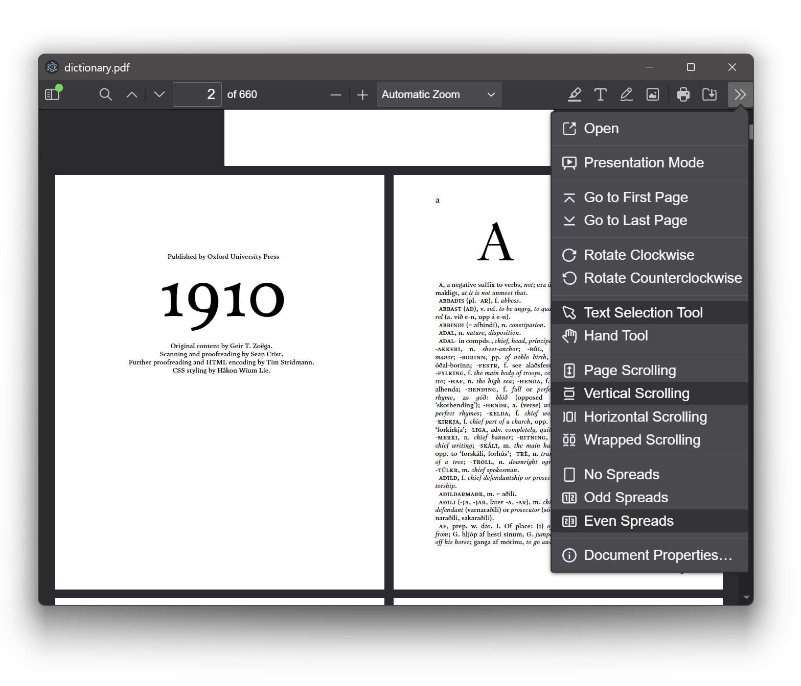
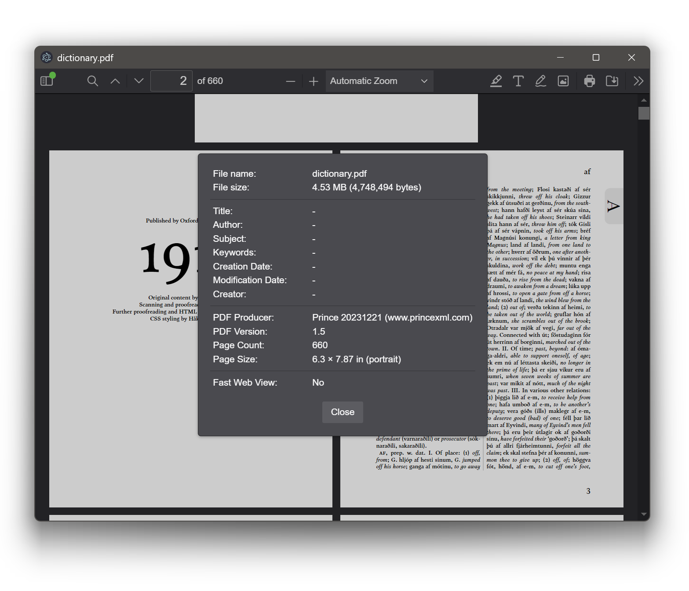

# LitePDF 

A free and lightweight no-BS PDF viewer. And no, it doesn't have AI.

## 💾 Install

[Windows 10/11 64bit Setup](https://github.com/dankrusi/LitePDF/releases/download/v1.0/LitePDF-1.0.0-win-x64.exe)

## ⚡ Features

* Open a PDF
* Zoom/Paginate a PDF
* Print a PDF
* Search for text in a PDF
* Edit and markup up a PDF
* Fullscreen reading
* *Fast and lightweight!*

## 🙌 Features it *doesn't* have

* Tabs
* AI integration
* Home screen
* Cloud storage
* Chat with your PDF files

## 📺 Screenshots

## 🚀 Installation

TODO

## 🎁 Donate

Do you like LitePDF?

[Donate via PayPal](https://www.paypal.com/donate/?hosted_button_id=B7BD77RRHJX6G)

## 💻 Compatibility

Currently this app is compatible with Windows 10 and Windows 11. 

However you can build it for Linux and MacOS as well. Binaries will be provided soon...

## 🗺️ Roadmap

TODO

## 📜 Changelog

See [CHANGELOG.md](https://github.com/dankrusi/LitePDF/blob/main/CHANGELOG.md)

## 🤔 Frequently Asked Questions

TODO

## ⚒ Building & Contributing

TODO

## 🙏 Thanks

TODO

App Icon Base: https://commons.wikimedia.org/wiki/File:PDF_file_icon.svg
